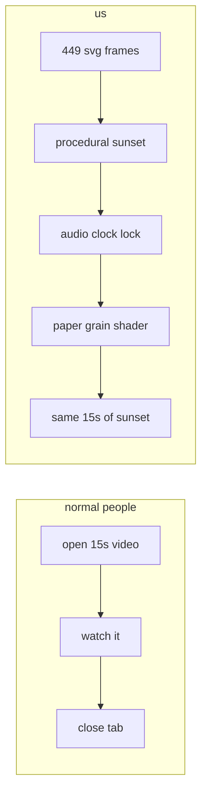
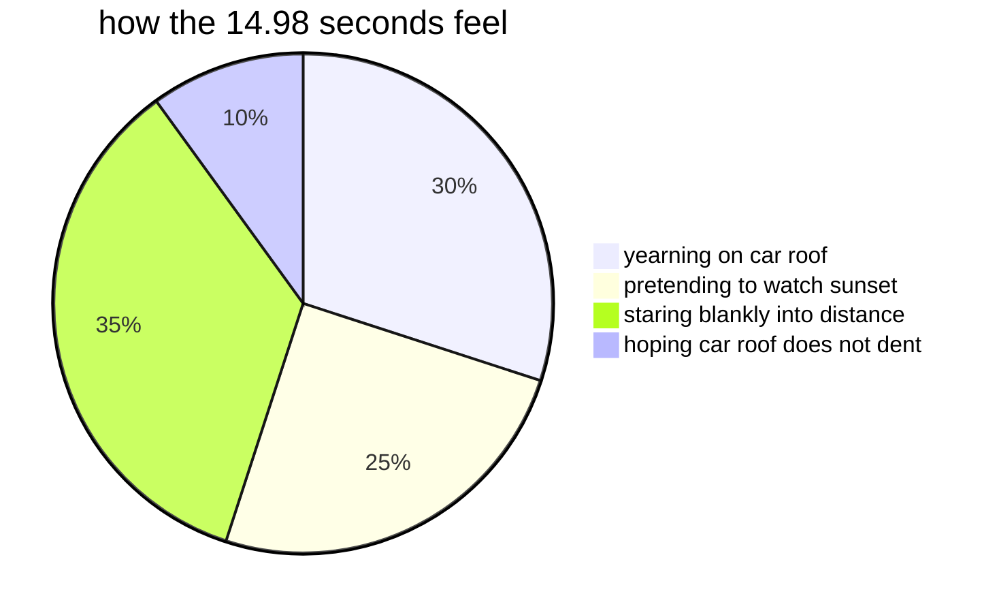
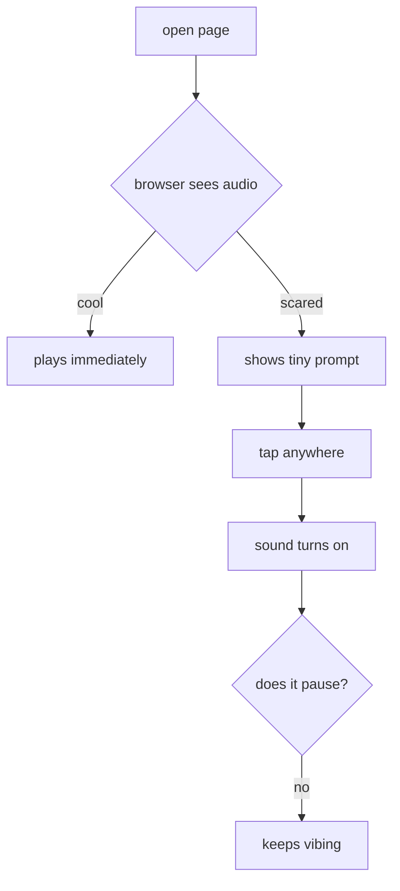
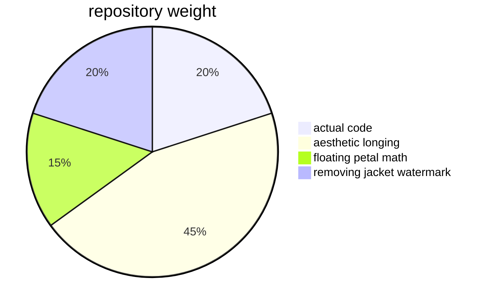

# no context 🌅

> an anime sunset rooftop scene. in your browser. because why just watch an mp4 when you can overcomplicate it with code.

[](https://opensource.org/licenses/MIT)
[](#file-map)
[](#file-map)

---

### what is this?

- girl sits on vintage car roof.
- boy stands by railing in oversized coat.
- sunset goes crazy.
- lyrics appear.
- feelings occur.

zero frameworks. zero node_modules. zero dependencies.  
just pure html, css, svg, and unprovoked emotional damage.



---

### timeline

- **0.00s – 4.46s (the wide rooftop shot)**  
  she sits on a car.  
  he stands by the railing pretending to look natural.  
  distant windows flicker.  
  leaves blow around.

- **4.47s – 14.98s (the dramatic hard cut)**  
  instant cut to his face.  
  80% peach sky, 20% him contemplating life.  
  lyrics float in.  
  immaculate autumn breeze energy.



---

### stuff we over-engineered

- **rounded corners (28px)**: because square viewports are aggressive.
- **original extracted art**: every hair strand and blush tone intact.
- **watermark erased**: scrubbed the text off his jacket with pixel surgery.
- **living windows**: apartment lights gently pulse like someone is working late.
- **paper tooth grain**: 30 fps noise shader so it feels like physical paper.
- **audio on by default**: tap anywhere if browser gets scared.
- **will it pause when you tap?**: no. stop asking.
- **zero ui clutter**: no scrubbers. cursor auto-hides. pure vibes.



---

### repo composition



---

### controls

| key | what happens |
|---|---|
| `tap anywhere` | turns sound on. refuses to pause. |
| `space` | pauses the drama. |
| `f` or `double click` | fullscreen sunset. |
| `m` | mute (if someone walks in). |

---

### run it (takes 5 seconds)

no build steps. no npm install. no waiting.

```bash
git clone https://github.com/MdKasif0/No-Context.git
cd "No Context"
python3 server.py
```

open `http://localhost:8766`.  
put headphones on.  
pretend it is 2004.

---

### file map

```
No Context/
├── index.html              # the stage
├── server.py               # zero-cache server
├── audio.mp3               # sync soundtrack
├── styles/
│   ├── main.css            # rounded 1:1 frame & shadows
│   └── anime-theme.css     # watercolor & paper filters
├── src/
│   ├── scene.js            # master compositor
│   ├── core/
│   │   ├── engine.js       # 30 fps clock locked to audio
│   │   └── camera.js       # subtle handheld camera drift
│   └── visual/
│       ├── sky-clouds.js   # sunset clouds
│       ├── cityscape.js    # skyline & flickering windows
│       ├── foliage.js      # swaying trees
│       ├── railing-car.js  # car & railing
│       ├── characters.js   # scene 1
│       ├── scene2.js       # scene 2 close-up
│       ├── particles.js    # floating petals
│       ├── lyrics.js       # handwritten lyrics
│       └── paper-texture.js# real-time grain
└── assets/
    ├── female-character.png # clean extracted art
    └── male-character.png   # watermark-free art
```

---

### license

mit. do whatever you want. just keep the corners rounded.
